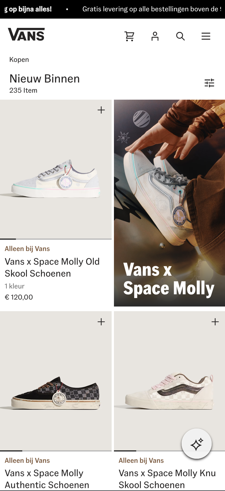
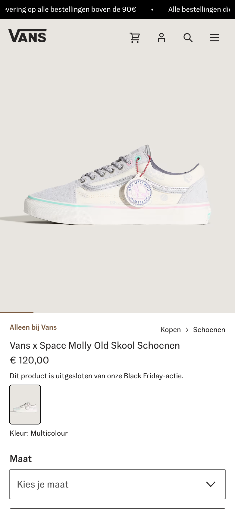
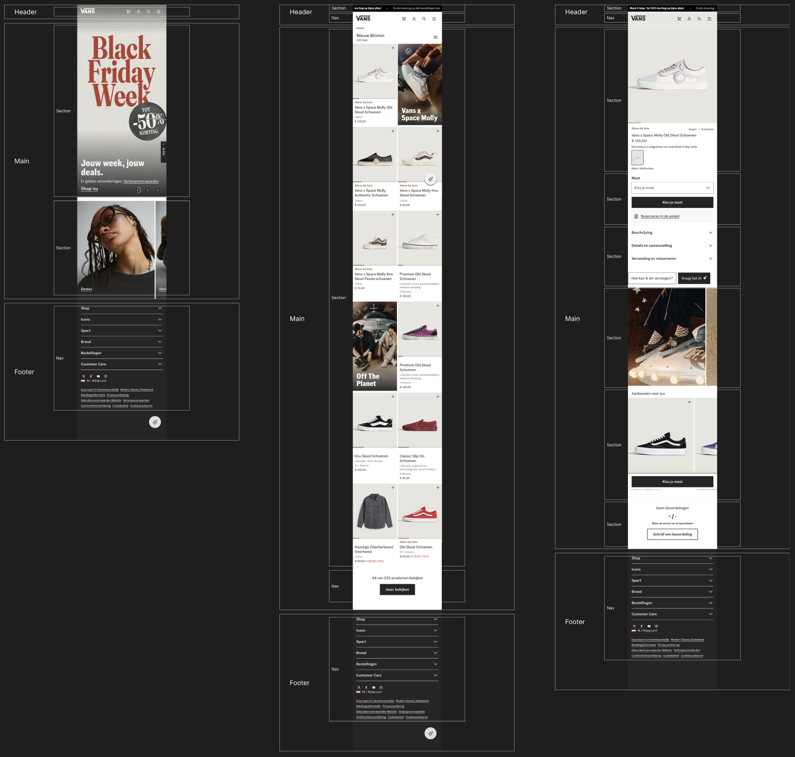

# Procesverslag
Markdown is een simpele manier om HTML te schrijven.  
Markdown cheat cheet: [Hulp bij het schrijven van Markdown](https://github.com/adam-p/markdown-here/wiki/Markdown-Cheatsheet).

Nb. De standaardstructuur en de spartaanse opmaak van de README.md zijn helemaal prima. Het gaat om de inhoud van je procesverslag. Besteedt de tijd voor pracht en praal aan je website.

Nb. Door *open* toe te voegen aan een *details* element kun je deze standaard open zetten. Fijn om dat steeds voor de relevante stuk(ken) te doen.

## Jij

  
uitwerken voor kick-off werkgroep

  ### Auteur:
  Roos Buskermolen

  #### Je startniveau:
  Ik ga voor de rode pisten

  #### Je focus:
  Surface plane
 

## Je website

  
uitwerken voor kick-off werkgroep

  ### Je opdracht:
  https://www.vans.com/nl-nl

  #### Screenshot(s) van de eerste pagina (small screen): 
  Home pagina Vans
  

  #### Screenshot(s) van de tweede pagina (small screen):
  Overzicht Vans schoenen
  

  #### Screenshot(s) van de derde pagina (small screen):
  Detail schoen Vans
  
 

## Toegankelijkheidstest 1/2 (week 1)

  
uitwerken na test in 2e werkgroep

  ### Bevindingen
  Doordat ik veranderd ben van website moet ik dit nog een keertje doen. Voeg het zo snel mogelijk toe!

## Breakdownschets (week 1)

  
uitwerken na afloop 3e werkgroep

  ### de hele pagina: 
  

  ### dynamisch deel (bijv menu): 
  

  ### wellicht nog een dynamisch deel (bijv filter): 
  

## Voortgang 1 (week 2)

  
uitwerken voor 1e voortgang

  ### Stand van zaken
  Wat er minder goed ging:
  Mijn website die ik eerst had gekozen heeft al zijn pagina's verwijderd en een nieuwe home pagina gemaakt. Hierdoor kan ik niet verder met die website en heb ik 20 november een nieuwe website moeten kiezen. Hierdoor loop ik erg achter en doe ik mijn best om zo snel mogelijk weer bij te lopen.

  Wat wel goed gaat:
  Ik begrijp de code en vind het ook heel leuk, ik heb snel door wanneer ik wat kan gebruiken en hoe de secties zijn opgebroken. Ondanks dat ik opnieuw moet beginnen heb ik wel het idee dat het goed gaat komen.

  ### Agenda voor meeting
  samen met je groepje opstellen
  #### Eva:

  #### Loïs:

  #### Roos:
    - Hoe kan ik in mijn menu nog een menu maken?
    - Wat valt er onder de header?
    - Hoe vind ik de iconen?

  #### Emilie:
    - Tot hoever moet de website in detail uitgewerkt worden?
    - Waarom speelt de video niet af en hoe kan ik zorgen dat ie niet automatisch gaat afspelen
    - Hoe zet ik de font in mijn css?

  ### Verslag van meeting
  hier na afloop snel de uitkomsten van de meeting vastleggen
  - headingsmap -> extention
  - Hoeft maar 1 laag in de navigatie menu, niet nog een extra laag
  - Margin en padding 0 in ul zodat de bovenste ruimte weg gaat
  - Header is alleen het menu (nav), omdat deze altijd terug komt op iedere pagina
  - Mapje fonts, op regel 1 in algemeen css. @font-face. Goede naam bij de font-family. Geen andere naam voor bold, onderschijd maken in de font-face doormiddel van font-weight.
  - 1 animatie met Java Script buiten het hambruger menu om.
  - Footer moet wel details met een summary gebruiken
  - icons mag je zelf toevoegen, of na maken.

## Voortgang 2 (week 3)

  
uitwerken voor 2e voortgang

  ### Stand van zaken
  Wat ging er goed:
  Eigenlijk ging er heel veel goed, ik heb zo goed mogelijk geprobeerd mijn achterstand in te halen. Ik vind het ook leuk om te doen wat het makkelijk maakt. Het kijken in de verschillende sections en andere factoren is soms nog wat lastig omdat er geen divs gebruikt mogen worden, maar door veel te proberen gaat het goed en krijg ik een netjes resultaat. 

  Wat ging er minder goed:
  Ik heb nog niet altijd door wat ik waarvoor kan gebruiken, betekent niet dat het niet goed gaat, alleen dat het meer tijd kost. Ook JavaScript is nog lang niet iets wat ik snap of heel goed in ben. Ik wil het wel allemaal proberen, maar of het 100% echt zo gaat lukken is nog maar de vraag. Ook heb ik het idee dat ik erg achterloop, maar dat blijf ik denk ik wel houden tot de tijd erop zit en het toch is gelukt.

  ### Agenda voor meeting
  samen met je groepje opstellen
  #### Eva:
    - hoe pas ik flexbox (of een grid) toe op een description list zonder divs te gebruiken?
    - is het legaal om een font van onlinewebfonts.com te downloaden en toe te voegen met @fontface?
    - kan ik beter een grid of flexbox gebruiken voor de layout van mijn sections?
    - wat is de beste tag voor een label?

  #### Loïs:
    - Als er een timer midden in de tekst staat, moet dit dan toegevoegd worden in html en zo ja hoe voeg je dit toe?
    - Kan je ook meerdere sections in een section hebben of dien je dan articles te gebruiken?

  #### Roos:
    - hoe krijg ik een gradiant op mijn foto?
    - hoe spreek ik meerdere types aan zonder dit 2x het zelfde erin te moeten zetten met nth-of-type()
    - hoe krijg ik die pijltjes gestyld in de details/summary

  #### Emilie:
    - hoe krijg ik de puntjes bij mijn lijst weg?
    - Ik heb een div is dit div waardig?
    - Hoe zet ik de svg er goed in?

  ### Verslag van meeting
  hier na afloop snel de uitkomsten van de meeting vastleggen
    -

## Toegankelijkheidstest 2/2 (week 4)

  
uitwerken na test in 9e werkgroep

  ### Bevindingen
  Lijst met je bevindingen die in de test naar voren kwamen (geef ook aan wat er verbeterd is):

## Voortgang 3 (week 4)

  
uitwerken voor 3e voortgang

  ### Stand van zaken
  hier dit ging goed & dit was lastig (neem ook screenshots op van delen van je website en code)

  ### Agenda voor meeting
  samen met je groepje opstellen

  | student 1      | student 2          | student 3    | student 4        |
  | ---            | ---                | ---          | ---              |
  | dit bespreken  | en dit             | en ik dit    | en dan ik dat    |
  | en dat ook nog | dit als er tijd is | nog een punt | dit wil ik zeker |
  | ...            | ...                | ...          | ...              |

  ### Verslag van meeting
  hier na afloop snel de uitkomsten van de meeting vastleggen

  - punt 1
  - punt 2
  - nog een punt
  - ...

## Eindgesprek (week 5)

  
uitwerken voor eindgesprek

  ### Je uitkomst - karakteristiek screenshots:
  

  ### Dit ging goed/Heb ik geleerd: 
  Korte omschrijving met plaatjes

  

  ### Dit was lastig/Is niet gelukt:
  Korte omschrijving met plaatjes

  

## Bronnenlijst

  
continu bijhouden terwijl je werkt

  Nb. Wees specifiek ('css-tricks' als bron is bijv. niet specifiek genoeg). 
  Nb. ChatGpT en andere AI horen er ook bij.
  Nb. Vermeld de bronnen ook in je code.

  1. [bron 1](https://www.a11yproject.com/posts/how-to-hide-content/)
  2. bron 2
  3. ...

